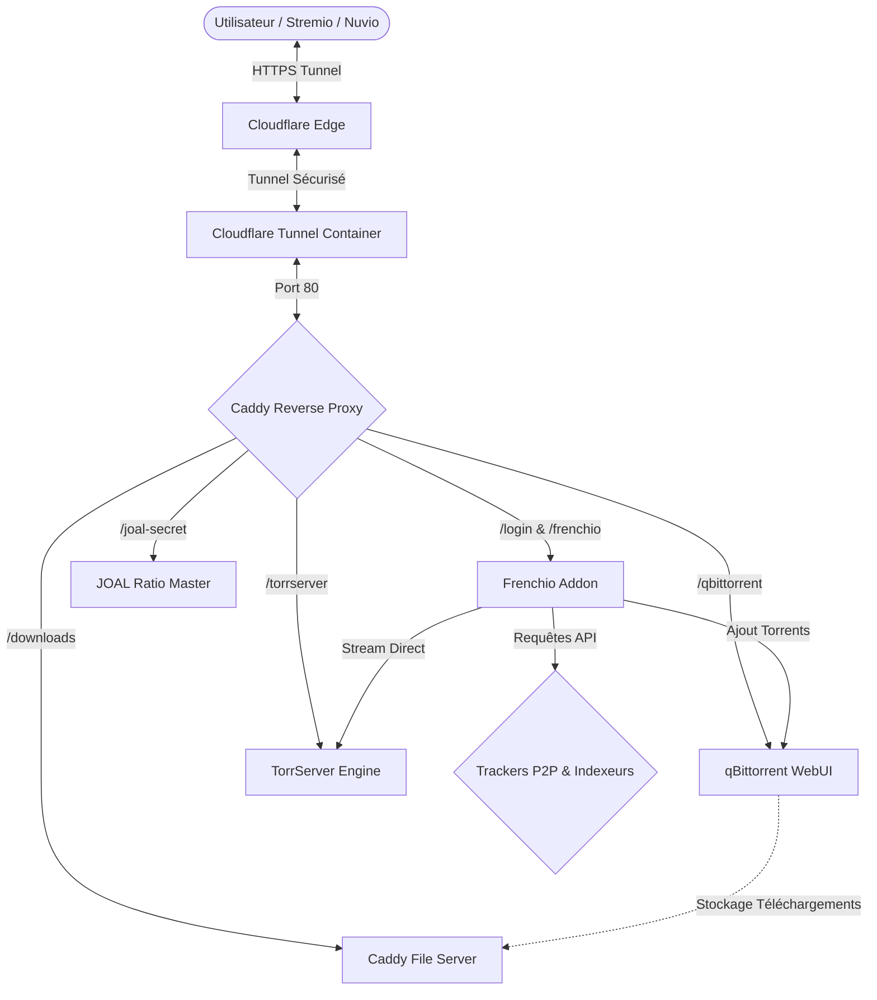
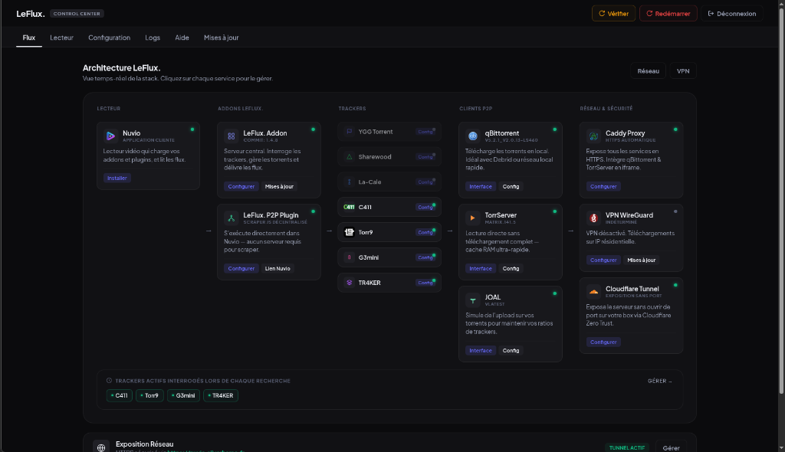
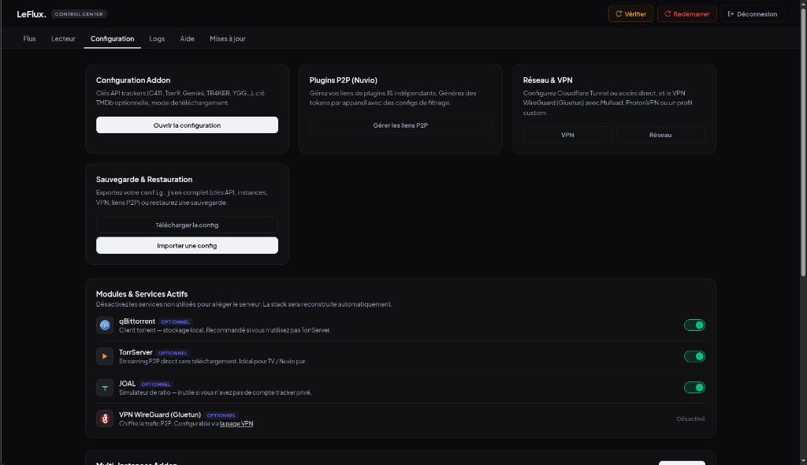
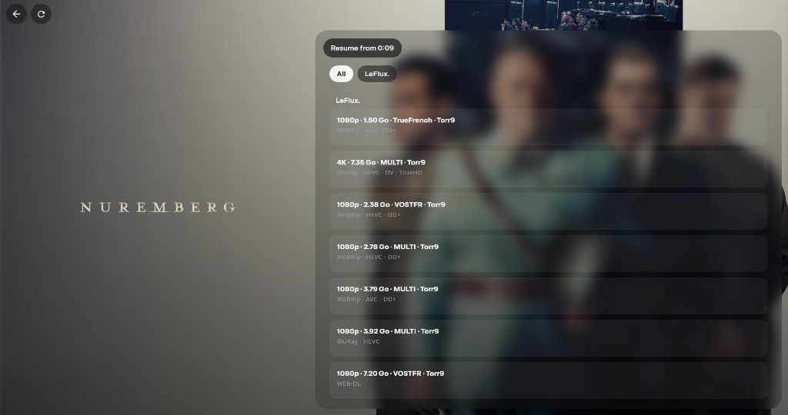
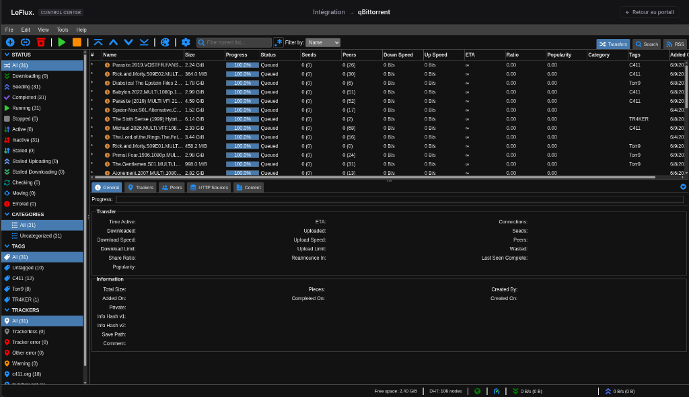
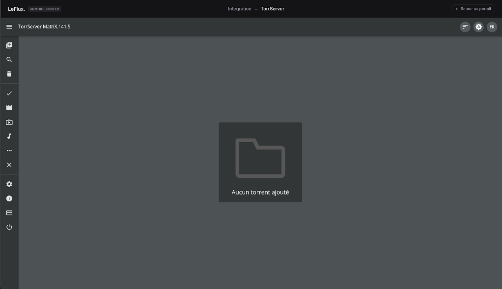
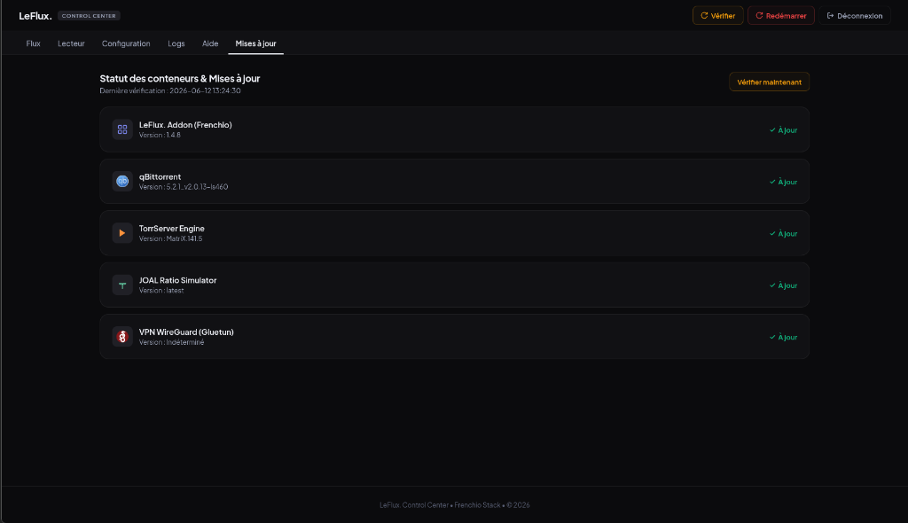
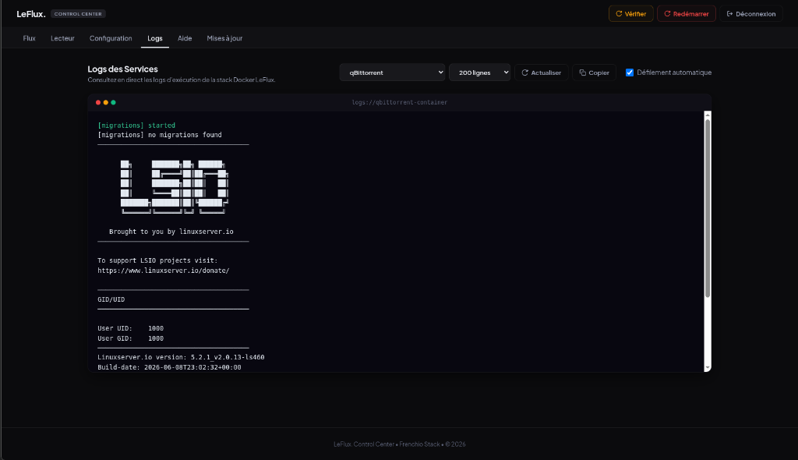

<p align="center">
  
</p>

# <p align="center">LeFlux. Media Stack</p>

<p align="center">Portail multimédia et moteur de streaming P2P décentralisé, auto-hébergé et optimisé pour l'écosystème francophone.</p>

---

## Démarrage Rapide

Pour installer et configurer l'ensemble de la stack en une seule commande :

```bash
git clone https://github.com/bastonus/LeFlux..git && cd LeFlux. && sudo ./install_leflux.sh && sudo ./start.sh
```

---

## Présentation

LeFlux est une solution d'auto-hébergement multimédia conçue pour regrouper et orchestrer vos applications de streaming et de torrent. Elle intègre un moteur de streaming P2P, des utilitaires de diagnostic, une interface d'administration épurée et sécurisée par mot de passe, ainsi qu'une connectivité via les tunnels Cloudflare.

> [!NOTE]
> Cette stack fonctionne sans abonnement de débridement externe (RealDebrid, Alldebrid, etc.) en exploitant directement le protocole BitTorrent et les indexeurs partenaires.

---

## Architecture de la Stack

Flux de communication entre les services :



---

## Services Inclus

*   **Portail Centralisé** : Point d'accès unique sécurisé redirigeant vers l'ensemble des applications (Nuvio Web, qBittorrent, Joal).
*   **Addon Frenchio P2P** : Indexation de métadonnées (TMDB/IMDB) et interfaçage avec les trackers français.
*   **Streaming à la Volée** : Intégration de TorrServer pour prévisualiser ou lire des flux vidéo sans attente de téléchargement.
*   **Proxy Inverse Caddy** : Gestion automatique des règles CORS pour les players Stremio/Nuvio, isolation d'interfaces et gestion SSL.
*   **Tunnel Zero Trust (Cloudflare)** : Exposition publique sécurisée sans configuration de redirections de ports (NAT) sur le routeur.
*   **Simulateur de Partage (JOAL)** : Automatisation des métriques de partage pour maintenir les ratios sur les trackers privés.

---

## Guide d'Installation

### Prérequis

*   Système d'exploitation Linux (Debian 13 recommandé).
*   Docker et Docker Compose (v2) installés.
*   Nom de domaine configuré sur Cloudflare.

### Déploiement

1. Cloner le dépôt :
    ```bash
    git clone https://github.com/bastonus/LeFlux..git
    cd LeFlux.
    ```

2. Exécuter le script de configuration :
    ```bash
    sudo ./install_leflux.sh
    ```

3. Lancer la stack :
    ```bash
    sudo ./start.sh
    ```

---

## Variables d'Environnement

La configuration est stockée dans le fichier `.env` de l'application :

| Variable | Description | Exemple |
| :--- | :--- | :--- |
| DOMAIN | Domaine public configuré | nuvio.votre-domaine.fr |
| TUNNEL_TOKEN | Token du tunnel Cloudflare Zero Trust | eyJhIjoiOWJkNTQ4... |
| MANIFEST_TOKEN | Clé unique statique de l'addon Stremio | 03aff957d44cf5... |
| CONFIG_B64 | Configuration des trackers encodée en Base64 | eyJ0bWRiX2tleSI... |

---

## Outils de Diagnostic

Un script permet de vérifier l'état des conteneurs, d'afficher les logs pertinents et d'effectuer des tests de connectivité locaux :

```bash
sudo ./debug.sh
```

---

## Captures d'Écran du Control Center

### 1. Tableau de bord principal (Dashboard)
Aperçu global en temps réel des services (lecteurs média, addons, indexeurs actifs, clients P2P, exposition réseau et état du VPN).


### 2. Panneau de Configuration
Gestion simplifiée des modules de la stack (qBittorrent, TorrServer, JOAL, VPN WireGuard) et sauvegarde de la configuration.


### 3. Lecteur Nuvio - Flux P2P Disponibles
Interface finale listant les streams et torrents trouvés en direct (résolution, taille, langue et source).


### 4. Client de Téléchargement qBittorrent
Suivi des torrents actifs et gestionnaire de stockage intégré au panneau d'administration.


### 5. Lecteur TorrServer Engine
Moteur TorrServer intégré pour le streaming direct en cache RAM sans téléchargement de fichier.


### 6. État des Conteneurs & Mises à jour
Vérification des versions des modules de la stack et notifications de mise à jour des conteneurs Docker.


### 7. Diagnostics et Console de Logs
Accès direct aux logs d'exécution des différents conteneurs (Caddy, qBittorrent, Joal, Frenchio Addon) pour simplifier les diagnostics.


---

## Sécurité

Ne partagez pas publiquement vos fichiers `.env`, `frenchio_backup_config.json` ou `stremio_link.txt` sans en avoir expurgé les jetons de connexion et passkeys.

